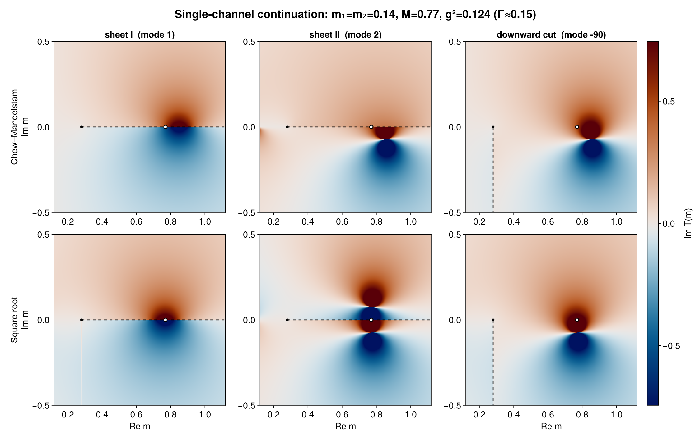

# Continuation examples

`continuation_heatmaps.jl` compares the imaginary part of a single-channel
amplitude for the square-root and Chew–Mandelstam phase spaces. It displays
sheet I, sheet II, and the `-90` downward-cut continuation in one 2×3 figure.

From the repository root, generate the figure with:

```sh
julia --project=docs -e 'using Pkg; Pkg.instantiate()'
julia --project=docs docs/continuation_heatmaps.jl
```

The dashed line marks the selected cut, the black point is the two-pion
threshold, and the white point marks the nominal resonance mass.


